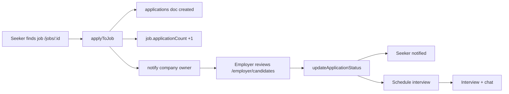
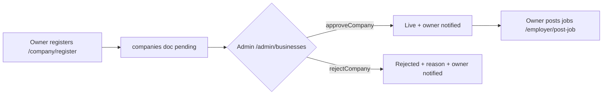
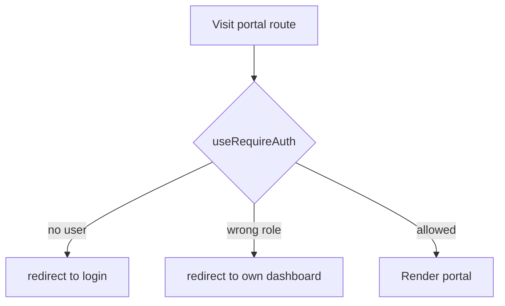

# THENIJOBS — Complete App Documentation

> Local jobs, business directory & services platform for **Theni district & Tamil Nadu**
> Domain: thenijobs.com · Firebase project: `thenijobs-9f01d`
> **This document reflects the live source as of 2026-06-06** (supersedes the older `full.md`, which lists an outdated stack and removed roles).

---

## Table of Contents
1. [Overview](#1-overview)
2. [Tech Stack](#2-tech-stack)
3. [User Roles & Access](#3-user-roles--access)
4. [Complete Route Map](#4-complete-route-map)
5. [Authentication System](#5-authentication-system)
6. [Workflows](#6-workflows)
7. [Service Functions Reference](#7-service-functions-reference)
8. [Custom Hooks Reference](#8-custom-hooks-reference)
9. [Contexts (Global State)](#9-contexts-global-state)
10. [Data Model — Firestore Collections](#10-data-model--firestore-collections)
11. [Security Rules Summary](#11-security-rules-summary)
12. [Workflow Diagrams](#12-workflow-diagrams)

---

## 1. Overview

THENIJOBS is a multi-role local employment + business discovery platform. It combines a **job portal**, a **business directory**, a **service marketplace**, and **B2B lead generation**, with WhatsApp/direct contact integration and a mobile-first, PWA-ready UI. Navigation is bilingual (English + Tamil labels) and the platform is district-focused with Theni as the primary market.

The product is split into four experiences sharing one Firestore backend: **public** (anyone), **job seeker**, **employer / business owner**, and **admin**.

---

## 2. Tech Stack

| Layer | Technology |
|-------|-----------|
| Framework | Next.js 15.5.19 (App Router) |
| Language | TypeScript 5.9 (strict) |
| UI | React 19.2.4 |
| Styling | Tailwind CSS v4 (+ custom CSS) |
| Icons | lucide-react |
| Animation | framer-motion 12 |
| Forms / validation | react-hook-form 7 + zod 4 |
| Data fetching | Firebase SDK + @tanstack/react-query 5 |
| Charts | recharts 3 |
| Backend | Firebase Auth, Cloud Firestore, Cloud Storage, Cloud Functions (nodejs20) |
| Hosting | Firebase App Hosting (region `asia-south1`) |

Firebase web config is read **only** from `NEXT_PUBLIC_FIREBASE_*` env vars (the app throws on startup if any are missing — see `src/lib/firebase/config.ts`).

---

## 3. User Roles & Access

| Role | Portal root | Guard |
|------|-------------|-------|
| `job_seeker` | `/seeker/*` | `useRequireAuth(['job_seeker'])` |
| `employer` / `business_owner` | `/employer/*` | `useRequireAuth(['employer','business_owner'])` |
| `admin` / `super_admin` | `/admin/*` | `useRequireAuth(['admin','super_admin'], '/admin/login')` |
| (public) | everything else | none |

`useRequireAuth` redirects unauthenticated users to login and **role-mismatched** users to their own dashboard. Roles `supplier` and `service_provider` exist in older docs but are intentionally **removed from registration** until their portals are built.

---

## 4. Complete Route Map

**Public (no auth)**

| Route | Purpose |
|-------|---------|
| `/` | Home — hero, search hub, categories, featured businesses, trending jobs, stats, testimonials |
| `/jobs` | Job listing — search, filter, **sort** (latest/salary/relevance) |
| `/jobs/[id]` | Job detail + apply flow |
| `/businesses` | Business directory |
| `/businesses/[category]` | Category-filtered businesses |
| `/company/[slug]` | Public company profile (jobs + reviews) |
| `/services` | Service marketplace |
| `/pricing` | Subscription plans |
| `/id/[id]` | Public THENIJOBS ID card / profile |
| `/profile` | Generic profile view |
| `/login`, `/register`, `/forgot-password` | Auth |
| `/admin/login` | Admin auth |
| `/company/register` | Business/company registration |

**Job Seeker (`/seeker`)**: `dashboard`, `profile`, `resume`, `resume/builder`, `applications`, `saved-jobs`, `job-alerts`, `interviews`, `messages`, `notifications`, `rewards`, `ai-coach`, `skills`, `settings`, `subscription`

**Employer (`/employer`)**: `dashboard`, `company-profile`, `jobs`, `post-job`, `candidates`, `interviews`, `talent-search`, `leads`, `messages`, `reports`, `billing`, `reviews`, `settings`, `subscription`

**Admin (`/admin`)**: `dashboard`, `users`, `businesses`, `jobs`, `leads`, `services`, `subscriptions`, `ads`, `reviews`, `reports`, `notifications`, `security`, `settings`

*(57 page routes total.)*

---

## 5. Authentication System

Managed by `AuthContext` (`src/contexts/AuthContext.tsx`), exposed via `useAuth()`. It wraps Firebase Auth and merges the signed-in user with their Firestore `users/{uid}` document (role, profile, preferences, verification, `profileScore`).

**Available actions**

| Action | Description |
|--------|-------------|
| `signInWithEmail(email, password)` | Email/password sign-in |
| `signInWithGoogle()` | Google popup sign-in |
| Phone OTP | `signInWithPhoneNumber` + reCAPTCHA verifier (OTP login) |
| `createAccount(...)` | Registers user, creates `users/{uid}` doc with role + phone |
| `logout()` | `signOut(auth)` |

On registration, the chosen role determines the post-login redirect. Phone (when provided) is stored as `+91<number>` during account creation.

---

## 6. Workflows

### 6.1 Job Seeker journey
1. **Register** (`/register`) as Job Seeker → account + `users` doc created.
2. **Build profile & resume** (`/seeker/profile`, `/seeker/resume`, `/seeker/resume/builder`) — completion drives the dynamic **Profile Strength** meter.
3. **Search jobs** (`/jobs`) — filter + sort; **save** interesting jobs (`saveJob`) to `/seeker/saved-jobs`.
4. **Apply** (`/jobs/[id]`) — `applyToJob()` writes an `applications` doc, increments the job's application count, logs activity, and notifies the **company owner**.
5. **Track** (`/seeker/applications`) status changes; receive **notifications** + **interview** invites (`/seeker/interviews`).
6. **Engage**: in-app **chat** with employers (`/seeker/messages`), **job alerts** (`/seeker/job-alerts`), **AI coach** (`/seeker/ai-coach`), **skills** (`/seeker/skills`), and **gamification** rewards/badges (`/seeker/rewards`).

### 6.2 Employer journey
1. **Register company** (`/company/register`) → `companies` doc (owner = uid). Awaits **admin approval**.
2. Once approved, **post jobs** (`/employer/post-job`) — includes the application **deadline**.
3. **Receive applications** (`/employer/candidates`), review resumes, and **update status** (`updateApplicationStatus`) → seeker is notified.
4. **Schedule interviews** (`/employer/interviews`), **message** candidates (`/employer/messages`), **search talent** (`/employer/talent-search`).
5. **Manage** leads (`/employer/leads`), reviews (`/employer/reviews`), reports (`/employer/reports`), and **billing/subscription** (`/employer/billing`, `/employer/subscription`).

### 6.3 Admin journey
1. **Moderate businesses** (`/admin/businesses`) — `approveCompany` / `rejectCompany` / `verifyCompany` / `featureCompany`; owner is notified on approve/reject.
2. **Moderate jobs** (`/admin/jobs`) — `approveJob` / `rejectJob`.
3. **Manage users** (`/admin/users`) — `updateUserRole`, `verifyUser`, suspend/delete.
4. **Oversee** leads, services, subscriptions, ads, reviews, reports, broadcasts/notifications, security, settings.
5. All audit-worthy actions write to **`activityLogs`** via `logActivity()`.

### 6.4 Cross-cutting flows
- **Notifications**: `NotificationContext` streams the current user's `notifications` (bell + unread badge in every portal header); `markAsRead` / `markAllAsRead`.
- **Messaging**: `conversations` + `messages` subcollection; `useChat` for a thread, `useConversationList` for the inbox; typing status supported.
- **Leads**: public lead capture → assigned/owned → `updateLeadStatus`.
- **Reviews**: authenticated users review companies; surfaced on public company profiles.

---

## 7. Service Functions Reference

All in `src/lib/firebase/firestoreService.ts`.

**Stats & analytics**
- `getPlatformStats()` → totals (users, companies, active jobs, applications)
- `getEmployerStats(companyId)` · `getSeekerStats(seekerId)`
- `getSeekerAnalytics(seekerId)` · `getEmployerAnalytics(companyId)`

**Companies**
- `getCompanies(filters?)` · `getCompanyBySlug(slug)`

**Jobs**
- `getJobs(filters?)` · `getJobById(jobId)`

**Applications**
- `applyToJob(data)` — create application + notify owner + increment count + log
- `getApplications(filters?)` · `updateApplicationStatus(applicationId, status, ...)`

**Saved jobs**
- `saveJob(userId, jobId)` · `unsaveJob(userId, jobId)` · `getSavedJobs(userId)`

**Leads / Reviews / Interviews**
- `getLeads(filters?)` · `updateLeadStatus(leadId, status, notes?)`
- `getReviews(targetId?)`
- `getInterviews(filters?)`

**Notifications**
- `createNotification(data)` · `getNotifications(userId)` · `markNotificationRead(id)` · `markAllNotificationsRead(userId)`

**Admin / moderation**
- `approveCompany(companyId, adminId)` · `rejectCompany(...)` · `featureCompany(companyId, isFeatured)` · `verifyCompany(companyId)`
- `approveJob(jobId, adminId)` · `rejectJob(jobId, adminId)`
- `updateUserRole(...)` · `verifyUser(uid, adminId)` · `getUsers(filters?)`

**Catalog**
- `getServices(filters?)` · `getSubscriptions(filters?)` · `getAdvertisements(filters?)`

**Audit & generic CRUD**
- `logActivity(data)` · `getActivityLogs(limit?)`
- `createDocument(...)` · `updateDocument(...)` · `deleteDocument(collection, id)`

**Chat / messaging**
- `createConversation(data)` · `getConversations(userId)` · `sendChatMessage(...)` · `markMessagesRead(...)` · `setTypingStatus(...)`

**Gamification**
- `awardPoints(...)` · `getGamificationProfile(userId)` · `getPointActivities(userId, limit?)` · `awardBadge(...)` · `getLeaderboard(limit?)` · `updateAchievementProgress(...)`

---

## 8. Custom Hooks Reference

| Hook | File | Purpose |
|------|------|---------|
| `useAuth()` / `useAuthContext()` | `hooks/useAuth.ts` | Current auth state + actions |
| `useRequireAuth(roles?, redirectTo?)` | `hooks/useAuth.ts` | Client route guard with role check |
| `useCollection<T>(name, constraints[], {skip})` | `hooks/useFirestore.ts` | Realtime list; re-subscribes on constraint change |
| `useDocument<T>(name, id)` | `hooks/useFirestore.ts` | Realtime single doc |
| `useAddDocument(name)` / `useUpdateDocument(name)` / `useDeleteDocument(name)` | `hooks/useFirestore.ts` | Mutations with auto timestamps |
| `useUploadFile()` / `useDeleteFile()` | `hooks/useStorage.ts` | Cloud Storage upload/delete |
| `useRealtimeCount(...)` | `hooks/useRealtimeStats.ts` | Server-side count + live refresh |
| `usePlatformStats(skip?)` / `useEmployerStats(companyId)` / `useSeekerStats(seekerId)` | `hooks/useRealtimeStats.ts` | Dashboard stat blocks (`getCountFromServer`) |
| `useChat(conversationId)` / `useConversationList()` | `hooks/useChat.ts` | Messaging |
| `useAnalytics()` | `hooks/useAnalytics.ts` | Analytics data |
| `useGamification()` | `hooks/useGamification.ts` | Points, badges, achievements |

---

## 9. Contexts (Global State)

Mounted in `src/app/layout.tsx` as `AuthProvider → ToastProvider → NotificationProvider`.

| Context | Hook | Exposes |
|---------|------|---------|
| `AuthContext` | `useAuth()` | `user`, `loading`, `signInWithEmail`, `signInWithGoogle`, phone OTP, `createAccount`, `logout` |
| `ToastContext` | `useToast()` | `showToast(message, type)` — replaces all native `alert()` |
| `NotificationContext` | `useNotifications()` | `notifications`, `unreadCount`, `markAsRead`, `markAllAsRead` |

---

## 10. Data Model — Firestore Collections

| Collection | Holds | Read access (summary) |
|------------|-------|------------------------|
| `users/{uid}` | Account + profile, role, preferences, `profileScore` | owner or admin |
| `companies/{id}` | Business listings (ownerId, verification, featured) | public |
| `jobs/{id}` | Job posts (companyId, postedBy, deadline, isActive) | public |
| `services/{id}` | Service marketplace listings | public |
| `reviews/{id}` | Company/service reviews | public |
| `advertisements/{id}` | Ad slots | public; write admin |
| `seekerProfiles/{uid}` | Extended seeker profile | owner, employer, admin |
| `savedJobs/{id}` | Bookmarked jobs | owner / admin |
| `jobAlerts/{id}` | Saved job-alert criteria | owner / admin |
| `applications/{id}` | Job applications (resumeUrl, status) | seeker, employer/owner, admin |
| `interviews/{id}` | Scheduled interviews | participants / admin |
| `notifications/{id}` | Per-user notifications | owner / admin |
| `broadcasts/{id}` | Admin broadcasts | admin |
| `conversations/{id}` (+ `messages`) | Chat threads & messages | participants / admin |
| `leads/{id}` | B2B leads | assignee/owner/company owner/admin |
| `subscriptions/{id}` | Plan subscriptions | owner / company owner / admin |
| `payments/{id}` | Payment records | owner / company owner / admin |
| `supportTickets/{id}` | Support requests | owner / admin |
| `activityLogs/{id}` | Audit trail | admin read; authed create |
| `settings/{id}` | Public app settings | public read; admin write |
| `gamification/{uid}` (+ `activities`) | Points/badges/leaderboard | any authed read; owner/admin write |

---

## 11. Security Rules Summary

`firestore.rules` enforces role- and ownership-based access via helpers: `isAuthenticated`, `isOwner`, `userRole`, `isAdmin`, `isEmployer`, `isCompanyOwner`, `isParticipant`, plus field-level guards. Highlights:
- Users can only edit a whitelisted set of their own fields; role escalation is blocked.
- Company/job creators can edit their own records **except** verification/approval fields (admin-only).
- Application count can be incremented exactly by +1 by authed users (`isApplicationCountIncrement`).
- `gamification` is readable by any authenticated user (enables the leaderboard) but writable only by owner/admin.
- A final `match /{document=**} { allow read, write: if false; }` denies everything not explicitly allowed.

Composite indexes for all equality-plus-order queries live in `firestore.indexes.json` (applications, notifications, conversations, jobs, savedJobs).

---

## 12. Workflow Diagrams

### Apply → Hire loop

### Company onboarding & moderation

### Auth & role routing

---

*For status of bug fixes and the forward feature roadmap, see `STATUS_AND_ROADMAP.md`.*
